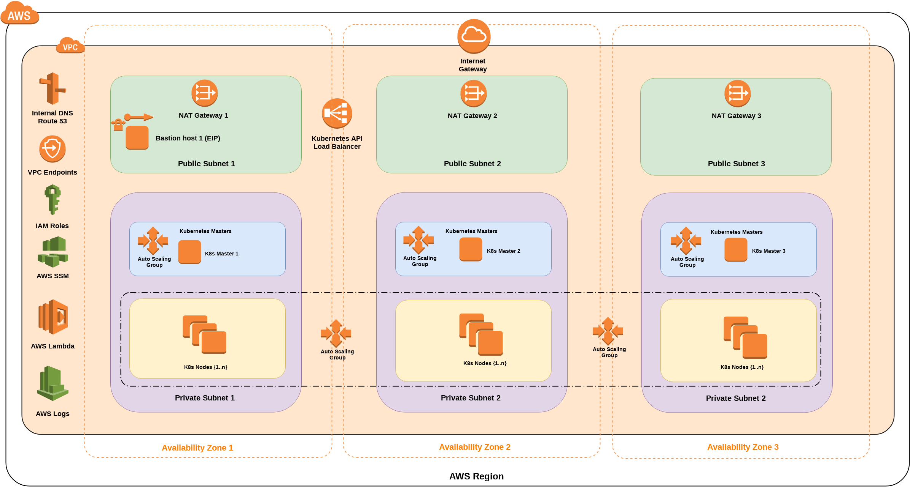

# Production grade Kubernetes deployment on AWS Cloud

This AWS CloudFormation template and scripts sets up a flexible, secure, fault-tolerant AWS environment and launches a Kubernetes cluster automatically into a configuration of your choice.

We created the project to show how easy to deploy a highly available, fault tolerant, full-scale Kubernetes environment on Amazon Web Services (AWS) Cloud, using Kubernetes Operations (kops) and AWS CloudFormation (CFN) templates together that automate the process. The final result is 100% Kubernetes (and "kops") compatible deployment, what you can manage from either the Bastion host or HTTPS API endpoint remotely.

We use the popular tool "kops" because it is the easiest and most elegant way to get a production grade Kubernetes cluster up and running. We keep focus on security and transparency for the whole deployment process. The guide is for IT architects, administrators, and DevOps professionals who are planning to implement  their Kubernetes workloads on AWS.

Combination of AWS Systems Manager (SSM) and AWS Lambda help with graceful cluster tear-down.

# Architecture

# Resources deployed

* one VPC: 3 private and 3 public subnets (6) in 3 different Availability Zones, Private Link routes to S3 and DynamoDB (free)
* three NAT gateways in each public subnet in each 3 Availability Zones
* three  self-healing Kubernetes Master instances in each Availability Zone's private subnet AutoScaling group (separate ASGs)
* three Node instances in AutoScalinn groups,  in each Availability Zone (one ASG)
* one self-healing Bastion host in 1 Availability Zone's public subnet, fixed Ubuntu 16.04 LTS,
* four Elastic IP Addresses: 3 for NAT Gateways, 1 for Bastion host
* one internal or public ELB load balancer for HTTPS access to the Kubernetes API
* two CloudWatch Logs group for Bastion hosts and Kubernetes Docker images
* one Lambda function for graceful teardown through SSM
* two security groups 1 for Bastion host, 1 for Kubernetes Hosts (Master and Nodes)
* a few IAM roles for Bastion hosts, Nodes and Master instances
* one S3 bucket for kops state store
* one Route53 private zone for VPC

# How To build your cluster

* Sign up for an AWS account at https://aws.amazon.com.

* Launch the [CloudFormation template](https://console.aws.amazon.com/cloudformation/home?region=eu-west-1#/stacks/new?stackName=Total-Cloud-Kubernetes&templateURL=https://s3-eu-west-1.amazonaws.com/tc2-kubernetes/latest/cfn-templates/latest.yaml )] into a new VPC, if you want to build a new AWS infrastructure. [View template](https://s3-eu-west-1.amazonaws.com/tc2-kubernetes/latest/cfn-templates/latest.yaml)

The cluster (via bastion host) creation lasts around 10 minutes, please be patient.

* Test the Kubernetes cluster by following the step-by-step instructions in the deployment guide.

To customize your deployment, you can choose different instance types for the Kubernetes cluster and the bastion host, choose the number of worker nodes, APi endpoint, install plug-ins.  

For detailed instructions, see the deployment guide.

# One-Click AWS Launch (new VPC)

[AWS One-Click CloudFormation Stack](https://console.aws.amazon.com/cloudformation/home?region=eu-west-1#/stacks/new?stackName=Total-Cloud-Kubernetes&templateURL=https://s3-eu-west-1.amazonaws.com/tc2-kubernetes/latest/cfn-templates/latest.yaml )

The cluster (via bastion host) creation lasts around 10 minutes, please be patient.

**After the clutser has been created, just connect to the bastion host via SSH, the "kops", "kubectl" and "helm" commands working out-of-the box, no extras steps needed!**

# Logs

ALL container logs sent to AWS CloudWatch Logs. Logs aren't  available internally via API (e.g. kubectl logs ... command: "Error response from daemon: configured logging driver does not support reading") Please check the AWS CloudWatch / Logs / K8s* for container logs.

# Abstract paper

Have a look at [this abstract paper](docs/TC2_Abstratct_production_grade_Kubernetes_deployment_on_AWS.pdf) for the high level details of this solution.

# Visit us

https://totalcloudconsulting.hu/en/solutions

# Costs and licenses

You are responsible for the cost of the AWS services used while running this deployment.
